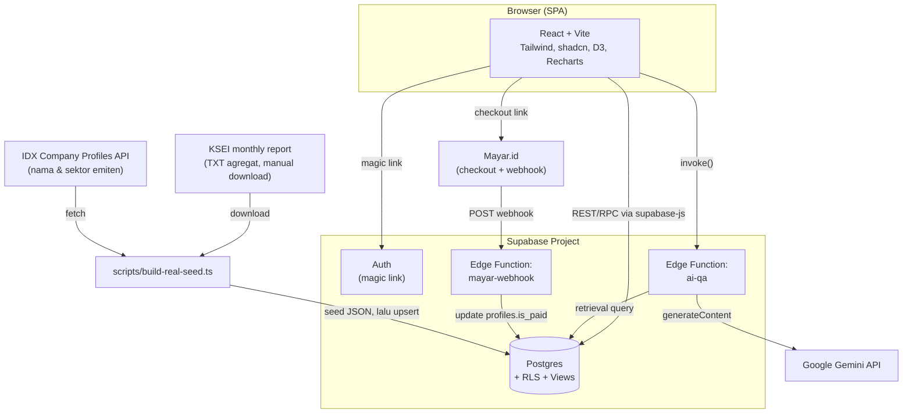

# Arsitektur

## Ringkasan tech stack

| Lapisan          | Teknologi                                                                                             |
| ---------------- | ----------------------------------------------------------------------------------------------------- |
| Frontend         | Vite + React 18 + TypeScript + Tailwind CSS + shadcn-style UI + React Router + TanStack Query         |
| Visualisasi      | D3.js (network graph, treemap heatmap), Recharts (pie & bar chart)                                    |
| Backend          | Supabase (Postgres + Auth magic link + Edge Functions + Row Level Security)                           |
| AI               | Supabase Edge Function → Google Gemini API                                                            |
| Pembayaran       | Mayar.id (checkout link + webhook)                                                                    |
| Hosting frontend | Statis (SPA) — bisa dideploy identik ke GitHub Pages, Netlify, Cloudflare Pages, Vercel, atau Lovable |

Frontend adalah **SPA 100% statis** — tidak ada server Node.js kustom di balik frontend. Semua logika yang butuh privasi (kunci Gemini API, secret webhook Mayar) berjalan di Supabase Edge Functions, bukan di browser.

## Diagram arsitektur

## Alur data kepemilikan saham

1. Operator mengunduh laporan bulanan KSEI "Kepemilikan Efek" (`Balancepos<YYYYMMDD>.txt`, agregat per tipe investor) secara manual dari situs resmi KSEI, dan meletakkannya di `data/raw/` (gitignored, diunduh ulang setiap bulan).
2. Daftar ticker yang dilacak (`data/reference/idx-tracked-tickers.json`, tracked di git) dicocokkan terhadap API publik "Company Profiles" IDX untuk nama & sektor emiten.
3. `scripts/build-real-seed.ts` mem-parsing file KSEI, menghitung `market_cap`, `change_pct`, dan breakdown per tipe investor, lalu menulis hasilnya ke `data/sample/real/{tickers,ownership_breakdown,prices}.json` untuk di-seed ke tabel `tickers`, `ownership_breakdown`, dan `prices`.
4. Frontend membaca data melalui **view publik** (`v_ticker_summary`, `v_ownership_preview`, dst.) untuk pengguna gratis, dan langsung dari tabel `ownership_breakdown` (dengan RLS) untuk pengguna berbayar.

## Alur pembayaran

1. Pengguna klik "Beli Akses Lifetime" di halaman Harga → diarahkan ke checkout Mayar.id.
2. Setelah pembayaran sukses, Mayar.id memanggil Edge Function `mayar-webhook` dengan detail transaksi.
3. Edge Function mencatat transaksi ke tabel `payments` dan mengaktifkan `profiles.is_paid = true` untuk email yang cocok.
4. Jika pembayaran terjadi sebelum pengguna pernah login, aktivasi otomatis terjadi saat login pertama (lihat trigger `handle_new_user` di migrasi database).

## Paywall

Pembatasan akses ditegakkan di **level database** melalui Row Level Security (RLS), bukan hanya di frontend:

- Tabel `ownership_breakdown` hanya bisa di-`SELECT` oleh pengguna dengan `profiles.is_paid = true`.
- View `v_ownership_preview` (dibuat dengan `security_invoker = false`) mem-bypass RLS tersebut secara terkontrol untuk mengekspos hanya 3 baris teratas (berdasarkan persentase) per ticker kepada siapa pun.

Lihat [Skema Database & RLS](skema-database.md) untuk detail lengkap.
